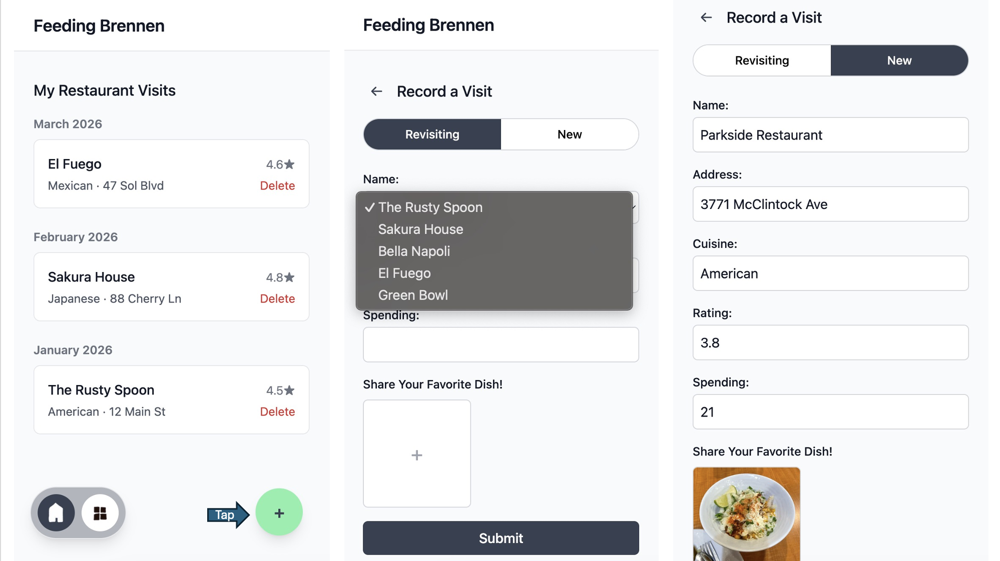
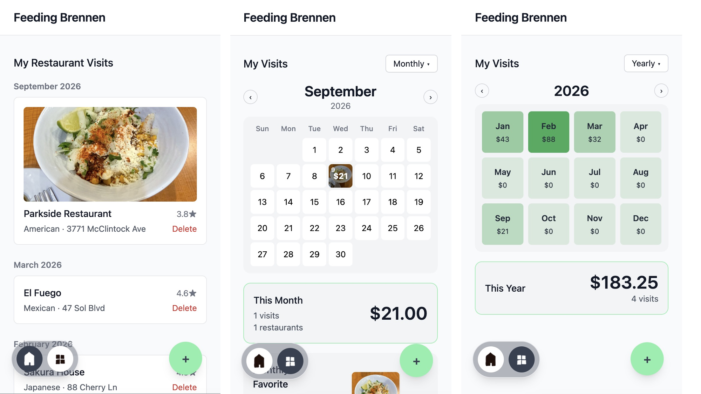

# Write-up

I accidently merged the pull request. I have reverted it and then opened a new pull request. So there are three branches now. Please see the lastest pull request for my changes in PartB and the main branch for part A.

## 1. What did you build for Part B, and why that?
I added a My Visits page with a VisitsCalendar feature to record the visits and spending by date. The page displays restaurants visited, amount spent each day in the boxes of the calendar, it contains monthly and yearly modes that each presents total spending, visits and favorite restaurant.
I chose to build this because it serves the main purpose of tracking Brennen's visits and spending in one page, and is visually clear and appealing such that it attracts users. Inspired by Alipay's calender tracker for daily financial investment gains/loss and the GitHub contributions graph, I decided calendar the best way to present the date number, spending number and restaurant(in form of picture background) all in one grid without being too messy. 

### Screenshots



## 2. What did you decide, and what did you rule out?

I decided to cut functions like search/map/online rating posting due to time issues and because they are common in other food apps but do not related to this app's purpose as a personal tracker instead of an social explorer so I abandoned the notes in visits table. I added dish_photo for restaurants to make it more visually appealing and updated_at to distinct cases of revisiting the same restaurant.
I merged my initial idea of My Visits and My Spending page together into the VisitsCalendar. So the route /api/spending and the spending types in apiClient were all abandoned. Instead I added VisitWithRestaurant, RestaurantSpending, and SpendingSummary interfaces for storing spending and number of visits by restaurant, date, and the sum.

## 3. Where did you cut corners?

I used AI for many frontend features in this code, and I still think my current way of storing spendingByRestaurant, spendingByDate in three interfaces is messy. I may edit the frontend more manually in the future, and also re-organize my way of storing Calendar data by maybe creating a seperate Month or Year table.

---

## Part B: routes

| Method and path | What it does | Success | Errors       |
| --------------- | ------------ | ------- | ------------ |
| `Get /api/restaurants` | Return restaurant (added dish_photo and updated_at for each) | `200` + JSON array| - |
| `POST /api/restaurants` | Create new restaurant (containing an optional dish_photo) | `201` + created restaurant | `400` if invalid input or duplicate|
| `GET /api/restaurants/:id` and `PUT /api/restaurants/:id` and `DELETE /api/restaurants/:id`| ... same as before(included updated_at and dish_photo) | same | same|
| `PATCH /api/restaurants/:id` | Update updated_at and dish_photo restaurant if its revisited| `200` + updated restaurant| `400` if invalid input; `404` if missing restaurant |
| `GET /api/visits`|Returns every visit, most recent first, with the restaurant name joined in | `200` + JSON array| - |
| `POST /api/visits` |Record a new visit, updates the restaurant | `201` + created visit | `400` on invalid input; `404` if restaurant body don't exist|
| `DELETE /api/visits/:id` | Delete a visit log (by clicking button on home page) | `204`, no body |`404` if missing or or invalid id |

**`POST /api/visits`**

```jsonc
// request
{ "restaurantId": 1, "amountSpent": 21, "dishPhoto": "data:image/png;base64,..." }

// 201 response
{
  "id": 7,
  "restaurantId": 1,
  "date": "2026-09-09",
  "amountSpent": 21,
  "notes": null,
  "dishPhoto": "data:image/png;base64,...",
  "createdAt": "2026-09-09T00:00:00.000Z"
}
```
**`PATCH /api/restaurants/1`**
```jsonc
// request
{"dishPhoto": "data:image/png;base64,..."}

// 200 response
{
  "id": 1,
  "name": "Example Restaurant",
  "cuisine": "Chinese",
  "address": "...",
  "rating": 4.5,
  "dishPhoto": "data:image/png;base64,...",
  "createdAt": "2026-09-01T00:00:00.000Z",
  "updatedAt": "2026-09-09T00:00:00.000Z"
}
```

## Schema changes

> Any migrations you added (`002_*.sql`, ...), new tables or columns, and
> anything a reviewer needs to run beyond `./setup.sh`. Write "none" if there
> were none.
Added `002_my_change.sql` for dish_photo and updated_at for the restaurants table.

## How I verified this


**Part A** - the contract table in CHALLENGE.md, every row including the error
cases:

```bash
# e.g.
curl -i http://localhost:3000/api/restaurants          # 200 + array
curl -i http://localhost:3000/api/restaurants/99999    # 404
curl -i http://localhost:3000/api/restaurants/abc      # 404
curl -i -X POST http://localhost:3000/api/restaurants \
  -H 'Content-Type: application/json' \
  -d '{"name":"Out Of Range","rating":6}'              # 400
```


**Part B** - the equivalent cases for what you built:

```bash
# Create a restaurant with a dish photo
curl -i -X POST http://localhost:3000/api/restaurants \
  -H 'Content-Type: application/json' \
  -d '{"name":"Test Restaurant","cuisine":"Chinese","dishPhoto":"data:image/png;base64,..."}'
# 201 + created restaurant with dishPhoto and updatedAt

# Update a restaurant's dish photo
curl -i -X PATCH http://localhost:3000/api/restaurants/1 \
  -H 'Content-Type: application/json' \
  -d '{"dishPhoto":"data:image/png;base64,..."}'
# 200 + updated restaurant with new dishPhoto and updatedAt

# PATCH with invalid input
curl -i -X PATCH http://localhost:3000/api/restaurants/1 \
  -H 'Content-Type: application/json' \
  -d '{"dishPhoto":123}'
# 400

# PATCH a restaurant that does not exist
curl -i -X PATCH http://localhost:3000/api/restaurants/99999 \
  -H 'Content-Type: application/json' \
  -d '{"dishPhoto":"data:image/png;base64,..."}'
# 404

# Record a new visit with a dish photo
curl -i -X POST http://localhost:3000/api/visits \
  -H 'Content-Type: application/json' \
  -d '{"restaurantId":1,"amountSpent":21,"dishPhoto":"data:image/png;base64,..."}'
# 201 + created visit; restaurant's dishPhoto and updatedAt are also updated

# Record a visit for a restaurant that does not exist
curl -i -X POST http://localhost:3000/api/visits \
  -H 'Content-Type: application/json' \
  -d '{"restaurantId":99999,"amountSpent":21}'
# 404

# Record a visit with invalid input
curl -i -X POST http://localhost:3000/api/visits \
  -H 'Content-Type: application/json' \
  -d '{"restaurantId":1,"amountSpent":-5}'
# 400

# Verify visits are returned with dishPhoto and restaurant information
curl -i http://localhost:3000/api/visits
# 200 + JSON array

# Delete a visit
curl -i -X DELETE http://localhost:3000/api/visits/7
# 204 + no body

```

## Known issues / what I'd do next

There's an error in the dish_photo for restaurant. The script is returning 400 instead of 200 when it received the photo, but the app worked fine in the browser inspector.